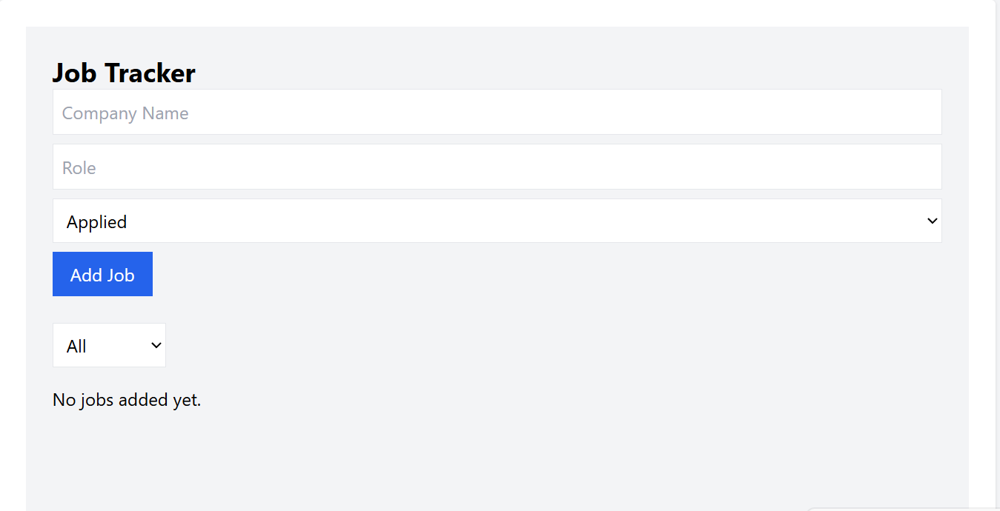
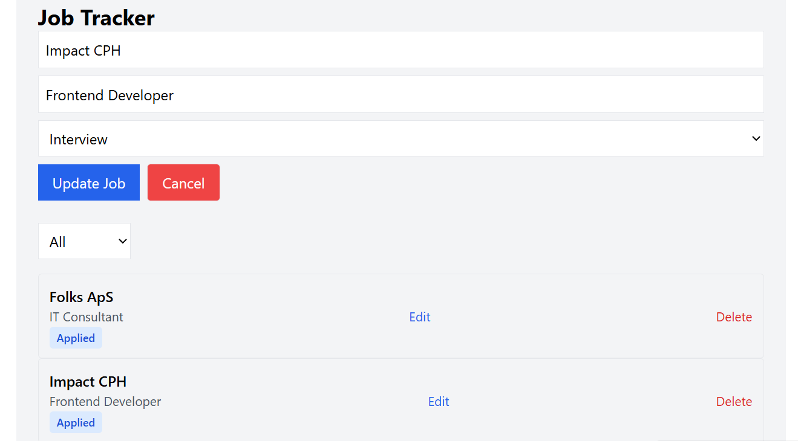
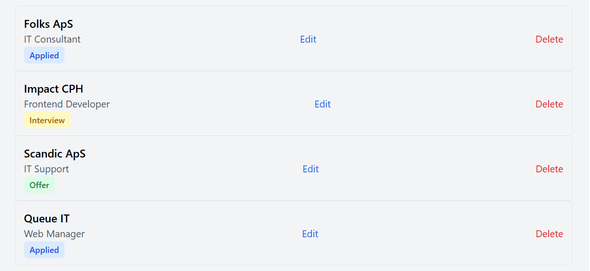
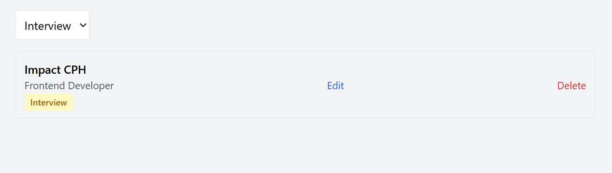

# Job Tracker

A job application tracker built with React, Vite, and Tailwind CSS.  
This project focuses on mastering React fundamentals through real-world patterns such as custom hooks, derived state, and controlled forms.

## Features

- Add, edit, and delete job applications
- Track application status (Applied, Interview, Offer, Rejected)
- Filter jobs by status
- Persistent data using localStorage
- Clean and reusable component structure

## Tech Stack

- React
- Vite
- Tailwind CSS

## Architecture Overview

- `App.jsx` manages high-level UI state and orchestration
- `useJobs` custom hook encapsulates job data logic and persistence
- Presentational components (`JobList`, `JobItem`, `StatusBadge`) focus on rendering
- Forms are controlled components reused for create and edit flows

## Key React Concepts Applied

- Component-driven architecture
- Controlled forms
- Lifting state up
- Custom hooks (`useJobs`)
- Side effects with `useEffect`
- Derived state (filtering without duplicated state)
- Reusing components for create and edit flows

## What I Learned

- How to minimize state and derive UI from existing data
- How to separate business logic from UI using custom hooks
- How to reason about UI without side effects
- How to design scalable and maintainable React components

## Live Demo

https://job-tracker-xyz.vercel.app

## Screenshots

### Dashboard



### Add Job


### Edit Jobs



### View All Applied job



### Filter Jobs



## Getting Started

```bash
npm install
npm run dev


```
